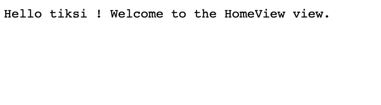

<h1 align=center>Tiksi JS</h1>
<p align=center>🔁 A fullstack modern javascript framework 🖼📝</p>
<p align=center>
    
    
</p>
<p align=center>
    
    
</p>
<hr>

<h3>The framework is based on MVC for project structure and RPC for communication between the server and the client.</h3>
<h2>Quick Start</h2>
<p>For a new project, just clone this repository :</p>

```bash
git clone https://github.com/TiksiJS/tiksi.git
```

<p>Now you should have these directories in your project folder :</p>
<ul>
    <li>controllers</li>
    <li>lib</li>
    <li>src</li>
    <li>views</li>
    <li>etc ...</li>
</ul>
<p>To run our server, run the command <code>run</code> in the cli.js :</p>

```bash
node cli.js run
```

<p>Now, you should see in your console the message :</p>

```bash
Server listening to port 8000, http://localhost:8000/ 
```

<p><a href="http://localhost:8000/ ">http://localhost:8000/ </a> : </p>

<h2>Why do you see <code>Hello tiksi !</code> ?</h2>
<p>Because when the router receive "/", in the file <code>routes.json</code>, it is defined that he must display the HomeController.index :</p>

```json
{
    "home": {
        "path": "/",
        "controller": "HomeController.index",
        "view": "HomeView"
    }
}
```

<p>Where is the HomeController.index ?</p>
<p>Just here, in <code>controllers/HomeController.js</code> :</p>

```javascript
exports.HomeController = {
    index() {
        return {
            name: 'tiksi'
        };
    }
};
```

<p>Here, we say that when the server call the function <code>index()</code>, he get the data </p>

```javascript
name: 'tiksi'
```

<p>Wait, where is the Hello in front of tiksi ?!</p>
<p>The hello is a member of the view : he is just here for diplay, so it's defined in the <code>views/HomeView :</code></p>

```twig
Hello {{ name }} ! Welcome to the HomeView view.
```

<p>The views are defined in twig. In twig, to display a variable, you must do <code>{{ variable name }}</code></p>
<p>Voila ! You have now a server running on tiksi based on mvc structure !</p>
<h2>What's next ?</h2>
<p>Go to Wiki tab andd read about the backend (RPC system ) or about the proxy and enjoy !</p>
